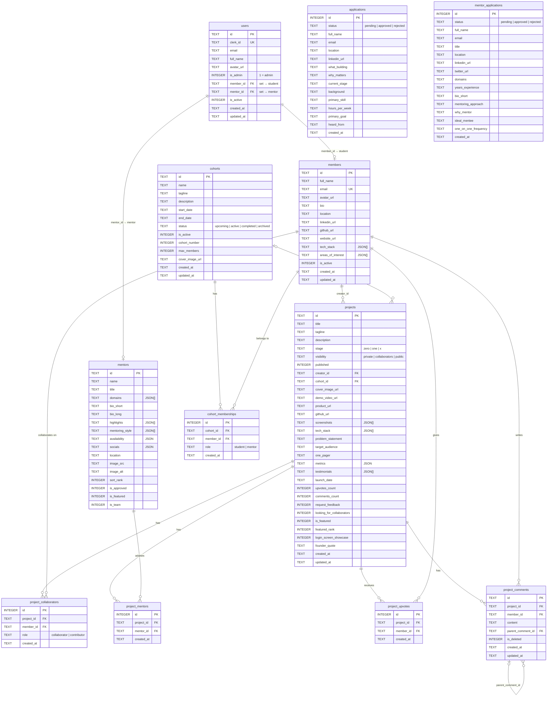

# Database Schema — Class Diagram

```mermaid
erDiagram

  %% ── Identity & Auth ─────────────────────────────────────────────────────

  users {
    TEXT id PK
    TEXT clerk_id UK
    TEXT email
    TEXT full_name
    TEXT avatar_url
    INTEGER is_admin "1 = admin"
    TEXT member_id FK "set → student"
    TEXT mentor_id FK "set → mentor"
    INTEGER is_active
    TEXT created_at
    TEXT updated_at
  }

  %% ── Core Platform Tables ─────────────────────────────────────────────────

  members {
    TEXT id PK
    TEXT full_name
    TEXT email UK
    TEXT avatar_url
    TEXT bio
    TEXT location
    TEXT linkedin_url
    TEXT github_url
    TEXT website_url
    TEXT tech_stack "JSON[]"
    TEXT areas_of_interest "JSON[]"
    INTEGER is_active
    TEXT created_at
    TEXT updated_at
  }

  mentors {
    TEXT id PK
    TEXT name
    TEXT title
    TEXT domains "JSON[]"
    TEXT bio_short
    TEXT bio_long
    TEXT highlights "JSON[]"
    TEXT mentoring_style "JSON[]"
    TEXT availability "JSON"
    TEXT socials "JSON"
    TEXT location
    TEXT image_src
    TEXT image_alt
    INTEGER sort_rank
    INTEGER is_approved
    INTEGER is_featured
    INTEGER is_team
  }

  cohorts {
    TEXT id PK
    TEXT name
    TEXT tagline
    TEXT description
    TEXT start_date
    TEXT end_date
    TEXT status "upcoming | active | completed | archived"
    INTEGER is_active
    INTEGER cohort_number
    INTEGER max_members
    TEXT cover_image_url
    TEXT created_at
    TEXT updated_at
  }

  %% ── Projects ─────────────────────────────────────────────────────────────

  projects {
    TEXT id PK
    TEXT title
    TEXT tagline
    TEXT description
    TEXT stage "zero | one | x"
    TEXT visibility "private | collaborators | public"
    INTEGER published
    TEXT creator_id FK
    TEXT cohort_id FK
    TEXT cover_image_url
    TEXT demo_video_url
    TEXT product_url
    TEXT github_url
    TEXT screenshots "JSON[]"
    TEXT tech_stack "JSON[]"
    TEXT problem_statement
    TEXT target_audience
    TEXT one_pager
    TEXT metrics "JSON"
    TEXT testimonials "JSON[]"
    TEXT launch_date
    INTEGER upvotes_count
    INTEGER comments_count
    INTEGER request_feedback
    INTEGER looking_for_collaborators
    INTEGER is_featured
    INTEGER featured_rank
    INTEGER login_screen_showcase
    TEXT founder_quote
    TEXT created_at
    TEXT updated_at
  }

  %% ── Join Tables ──────────────────────────────────────────────────────────

  cohort_memberships {
    INTEGER id PK
    TEXT cohort_id FK
    TEXT member_id FK
    TEXT role "student | mentor"
    TEXT created_at
  }

  project_collaborators {
    INTEGER id PK
    TEXT project_id FK
    TEXT member_id FK
    TEXT role "collaborator | contributor"
    TEXT created_at
  }

  project_mentors {
    INTEGER id PK
    TEXT project_id FK
    TEXT mentor_id FK
    TEXT created_at
  }

  project_upvotes {
    INTEGER id PK
    TEXT project_id FK
    TEXT member_id FK
    TEXT created_at
  }

  project_comments {
    TEXT id PK
    TEXT project_id FK
    TEXT member_id FK
    TEXT content
    TEXT parent_comment_id FK
    INTEGER is_deleted
    TEXT created_at
    TEXT updated_at
  }

  %% ── Inbound Applications (pre-approval) ──────────────────────────────────

  applications {
    INTEGER id PK
    TEXT status "pending | approved | rejected"
    TEXT full_name
    TEXT email
    TEXT location
    TEXT linkedin_url
    TEXT what_building
    TEXT why_matters
    TEXT current_stage
    TEXT background
    TEXT primary_skill
    TEXT hours_per_week
    TEXT primary_goal
    TEXT heard_from
    TEXT created_at
  }

  mentor_applications {
    INTEGER id PK
    TEXT status "pending | approved | rejected"
    TEXT full_name
    TEXT email
    TEXT title
    TEXT location
    TEXT linkedin_url
    TEXT twitter_url
    TEXT domains
    TEXT years_experience
    TEXT bio_short
    TEXT mentoring_approach
    TEXT why_mentor
    TEXT ideal_mentee
    TEXT one_on_one_frequency
    TEXT created_at
  }

  %% ── Relationships ────────────────────────────────────────────────────────

  users ||--o| members             : "member_id → student"
  users ||--o| mentors             : "mentor_id → mentor"

  cohorts ||--o{ cohort_memberships  : "has"
  members ||--o{ cohort_memberships  : "belongs to"

  members ||--o{ projects            : "creator_id"
  cohorts  |o--o{ projects           : "cohort_id"

  projects ||--o{ project_collaborators : "has"
  members  ||--o{ project_collaborators : "collaborates on"

  projects ||--o{ project_mentors    : "has"
  mentors  ||--o{ project_mentors    : "advises"

  projects ||--o{ project_upvotes    : "receives"
  members  ||--o{ project_upvotes    : "gives"

  projects ||--o{ project_comments   : "has"
  members  ||--o{ project_comments   : "writes"
  project_comments |o--o{ project_comments : "parent_comment_id"
```
